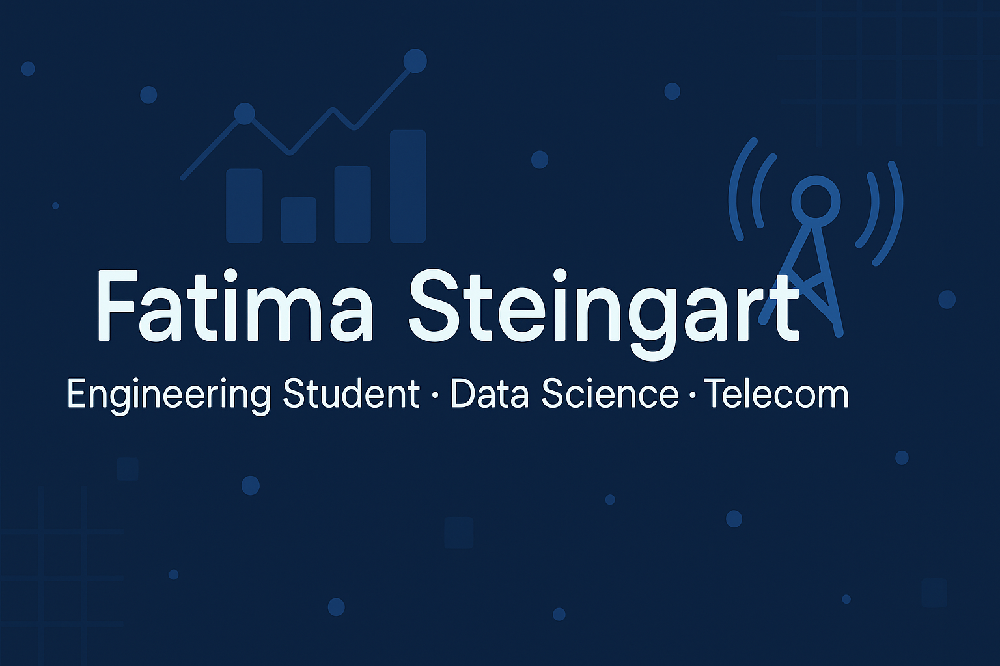

#  Hi there, I'm Fatima / Hola, soy Fatima

🎓 **Advanced Telecommunications Engineering student | Focused on Data Science & Embedded Systems**
---

## 🚀 What I'm working on / En qué estoy trabajando
- 📈 **Data Science**: EDA, visualization, and classical models (scikit-learn).  
- 🔌 **Telecom & Embedded Systems**: FPGA (VHDL), microcontrollers (AVR/Arduino), industrial protocols (OPC UA).    

---

## 🧰 Tech Stack
**Languages / Lenguajes:** Python · C/ASM (AVR) · VHDL · SQL · HTML/CSS/JS  
**Data/ML:** Pandas · Numpy · Scikit-Learn · Matplotlib · Plotly  
**Embedded / Embebidos:** Quartus · Proteus · Arduino IDE · Microchip Studio  
**DevOps:** Git · GitHub Actions · Docker (basic / básico)  

---

## 📌 Featured Projects / Proyectos Destacados (IN PROGRESS/EN PROCESO)  

🔹 **Netflix EDA** · Python, Pandas, Visualization  
> Exploratory data analysis with reproducible reports and clear visuals.  

---
## 📊 GitHub Stats

---

## 📫 Connect with me / Conectemos

